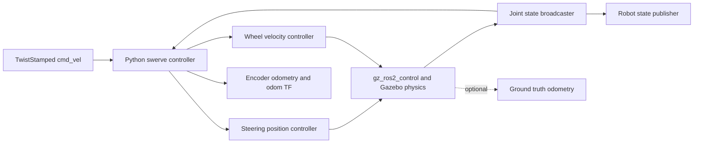

# Architecture

The package is a self-contained ROS 2 package. Model assets, configuration, world,
launch files and runtime nodes travel together. All runtime dependencies are public
ROS packages or Python libraries listed in `package.xml`.



`kinematics.py` is independent of ROS. It computes wheel commands and fits the body
twist from measured module states. `controller.py` handles ROS messages, timeouts,
command limiting and SE(2) pose integration. `bringup.py` validates configuration
and generates controller-manager parameters for each namespace.

The model uses x-forward, y-left and z-up. All wheel joint axes point along local
+y, so positive wheel angular velocity means rolling forward at zero steering.
Module order is front-left, front-right, rear-left, rear-right everywhere. Steering
axes intersect wheel centers; caster offsets and suspension are not modeled.

For module position `(x_i, y_i)` and commanded body twist `(vx, vy, wz)`:

```
u_ix = vx - wz * y_i
u_iy = vy + wz * x_i
theta_i = atan2(u_iy, u_ix)
wheel_rate_i = hypot(u_ix, u_iy) / wheel_radius
```

Adding pi to steering and reversing wheel rate gives the same rolling velocity.
The controller selects a feasible solution within ±pi/2; when both boundary
solutions are valid, it chooses the closest to current steering. Near-zero module
velocity retains its measured angle. Crossing the limited steering range can require
a large steering transition, during which motion will not track the requested twist
exactly. This is a finite steering chassis, not a continuously rotating steering model.

For odometry, each measured wheel velocity is projected along its measured steering
angle. The eight planar components form an overdetermined linear system for the
three body velocities. Its least-squares solution assumes no lateral slip at each
wheel. Gazebo ground truth is never used in that estimator or in the controller.

`swerve_drive.urdf.xacro` assembles `chassis.urdf.xacro` and
`plugins.urdf.xacro`. The chassis file contains only the physical link and joint
tree; all Gazebo tags live in the plugins file. The public model takes a single
configuration file argument, along with the names and paths needed to spawn it.
The single YAML configuration supplies dimensions to both Xacro and kinematics.

The launch interface selects one of two explicit Gazebo families. `ign` uses
Gazebo Sim 6, Ignition Transport message names and Ignition plugin names. `gz`
uses Gazebo Sim 8, Gazebo Transport message names and `gz-sim` plugin names.
Each family has a matching world and bridge YAML files. No runtime probing or
fallback aliases are used, so a requested family always produces one known set
of model, world and bridge settings.
Model link names, joint names and odometry frames share one prefix. ROS topics and
controller managers use a ROS namespace. Global TF topics combine frames from all
robots, while one world clock serves every robot.

The demo starts a local world and clock bridge. The spawn entry point joins a running
world, creates the model, waits for creation, activates the three ros2_control
controllers, then starts the swerve controller. Startup failure terminates that launch.
Each launch gets its own generated controller parameter file, cleaned up on shutdown.

The implementation intentionally targets the verified Humble/Fortress APIs. Porting
to another Gazebo generation includes reviewing world plugin names, the launch
version argument and bridge message names, followed by the same physical tests.
