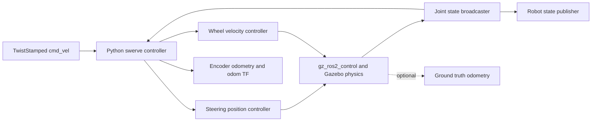

# Architecture

The package is a self-contained ROS 2 package. Model assets, configuration, world,
launch files and runtime nodes travel together. All runtime dependencies are public
ROS packages or Python libraries listed in `package.xml`.



`kinematics.py` is independent of ROS. It computes wheel commands and fits the body
twist from measured module states. `controller.py` handles ROS messages, timeouts,
command limiting and SE(2) pose integration. `motion.py` is a ROS-independent,
simulation-time supervisor for hysteresis, measured-stop confirmation, stable
alignment, transition deadlines and fault reset. `bringup.py` validates configuration
and generates controller-manager parameters for each namespace.

The spawn launch starts the controller as an independent Python module process
after the model has spawned and the ros2_control controllers have activated.
Launch manages its namespace, parameters and shutdown. The package installs no
standalone controller executable; no scripts directory or `ros2 run` entry is
required. Demo launch includes the corresponding spawn launch.

The model uses x-forward, y-left and z-up. All wheel joint axes point along local
+y, so positive wheel angular velocity means rolling forward at zero steering.
Module order is front-left, front-right, rear-left, rear-right everywhere. Steering
axes intersect wheel centers; caster offsets and suspension are not modeled.

For module position `(x_i, y_i)` and commanded body twist `(vx, vy, wz)`:

```
u_ix = vx - wz * y_i
u_iy = vy + wz * x_i
theta_i = atan2(u_iy, u_ix)
wheel_rate_i = hypot(u_ix, u_iy) / wheel_radius
```

Adding pi to steering and reversing wheel rate gives the same rolling velocity.
The controller selects a feasible solution within ±pi/2; when both boundary
solutions are valid, it chooses the closest to current steering. Near-zero module
velocity retains its measured angle. Crossing the limited steering range can require
a large steering transition. The controller holds all drive wheels at zero until
every measured steering angle reaches its target within the configured tolerance.
This is a finite steering chassis, not a continuously rotating steering model.

The three motion modes are differential, spin and crab. Differential mode accepts
`vx + wz` with `vy = 0` and uses double-Ackermann steering: front and rear modules
steer in opposite directions, with an individual speed for each turning radius.
Spin accepts pure `wz` and uses the four-wheel X pattern. Crab accepts translation
with `wz = 0` and keeps all modules parallel. Lateral translation plus yaw is
unsupported and produces a stop command.

Every mode transition invalidates the previous active mode. Braking holds steering
and commands zero wheel speed until all measured wheels stop and the new mode
request passes its dwell interval. Alignment then moves steering and requires a
continuous interval of measured alignment before drive becomes active. Differential
entry aligns at zero steering; steering error does not gate drive after activation.
Spin and crab retain alignment checks, including a new crab direction. Retargeting
a pending transition restarts request dwell but preserves its overall deadline.
Timeout latches a fault until a zero command. Zero commands and watchdogs stop
drive immediately and return steering home. The `drive_status` DiagnosticArray
reports requested/active mode, phase, steering error and blocking reason.

For odometry, each measured wheel velocity is projected along its measured steering
angle. The eight planar components form an overdetermined linear system for the
three body velocities. Gazebo ground truth is never used in the estimator or in the
controller.

`swerve_drive.urdf.xacro` assembles `chassis.urdf.xacro` and
`plugins.urdf.xacro`. The chassis file contains only the physical link and joint
tree; all Gazebo tags live in the plugins file. The public model takes a single
configuration file argument, along with the names and paths needed to spawn it.
The single YAML configuration supplies dimensions to both Xacro and kinematics.

Four fixed launch entry points provide the two Gazebo families:
`spawn_ign.launch.py`, `demo_ign.launch.py`, `spawn_gz.launch.py` and
`demo_gz.launch.py`. They share startup mechanics in `launch_support.py`;
no launch argument selects a family at runtime. `ign` uses
Gazebo Sim 6, Ignition Transport message names and Ignition plugin names. `gz`
uses Gazebo Sim 8, Gazebo Transport message names and `gz-sim` plugin names.
Each family has a matching world and one combined bridge YAML file. Demo selects
its world clock entry, and spawn selects its robot entries. The selected lists
are written to temporary bridge files and cleaned up on launch shutdown.
No runtime probing or
fallback aliases are used, so a requested family always produces one known set
of model, world and bridge settings.
Model link names, joint names and odometry frames share one prefix. ROS topics and
controller managers use a ROS namespace. Global TF topics combine frames from all
robots, while one world clock serves every robot.

The demo starts a local world and clock bridge. The spawn entry point joins a running
world, creates the model, waits for creation, activates the three ros2_control
controllers, then starts the swerve controller. Startup failure terminates that launch.
Each launch gets its own generated controller parameter file, cleaned up on shutdown.

The implementation intentionally targets the verified Humble/Fortress APIs. Porting
to another Gazebo generation includes reviewing world plugin names, the launch
version argument and bridge message names, followed by the same physical tests.
